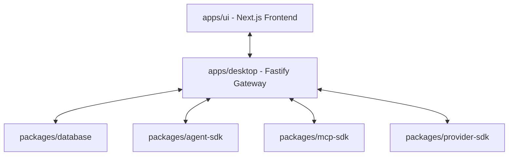

# VAS Desktop

> **The Agentic Desktop Platform & Unified Command Center**

VAS Desktop is an all-in-one desktop environment designed to unify AI agents, command-line interfaces (CLIs), and Model Context Protocol (MCP) servers into a single cohesive platform. Powered by Electron and Next.js, it empowers users with a centralized interface to manage, monitor, and run local and remote workflows.

---

## Key Features

*   **Unified CLI Orchestration**: Seamlessly detect and manage CLI agents (such as Aider, Claude CLI, Cline, and Codex) in local sub-processes.
*   **Model Context Protocol (MCP) Integration**: Manage, start, stop, and restart MCP servers to extend LLM capabilities with local system tools and contexts.
*   **Multi-Provider AI Registry**: Built-in support for Anthropic, OpenAI, Gemini, and other major LLM providers.
*   **Agentic Workspaces**: Orchestrate localized processes with automated monitoring, event logging, and auto-restart capabilities.
*   **Cross-Platform Support**: Optimized for Windows, macOS, and Linux.

---

## High-Level Architecture

The project is structured as a monorepo managed via `pnpm` and `turbo`:



### Applications (`apps/`)
*   **`desktop`**: Electron main process wrapper and background Fastify API gateway.
*   **`ui`**: Next.js desktop interface, providing a modern workspace layout and agent console.

### Shared SDKs & Packages (`packages/`)
*   **`agent-sdk`**: Handles CLI process spawning, standard input/output streaming, and lifecycle monitoring.
*   **`mcp-sdk`**: Manages client connections to external Model Context Protocol servers.
*   **`provider-sdk`**: Extensible interface for normalizing requests and responses across LLM providers.
*   **`database`**: Local SQLite database abstraction layer utilizing Drizzle ORM.
*   **`shared`**: General-purpose types, configuration schemas, and utility functions.

---

## Getting Started

### Prerequisites
*   [Node.js](https://nodejs.org/) (v18 or higher recommended)
*   [pnpm](https://pnpm.io/) (v8 or higher recommended)

### Installation
Clone the repository and install dependencies:
```bash
pnpm install
```

### Running the App locally (Development Mode)
To start both the Electron main process and Next.js frontend concurrently:
```bash
pnpm dev
```

### Building the App
To compile TypeScript and build production assets:
```bash
pnpm build
```

---

## Road to AGI Roadmap (CLI)

- [x] **Phase 0: Core CLI Foundation** — Dynamic ESM plugins, configuration loader, pino background logger, sandbox rules, and Effect-ts orchestration loop.
- [ ] **Phase 1: Skills & Plugins (Active)** — Folder-triggered `SKILL.md` system, plugin hook lifecycles, and auto-discovery.
- [ ] **Phase 2: Subagents & Orchestration** — Named background role-agents with message-based topologies.
- [ ] **Phase 3: MCP Tools** — Dynamic client configuration for Model Context Protocol servers.
- [ ] **Phase 4: Session Memory System** — Cross-session persistent memories and indexing.
- [ ] **Phase 5: Team Collaboration / CRDT** — Real-time offline-first sync (Yjs + LevelDB).

---

## License

Private / Proprietary. All rights reserved.
